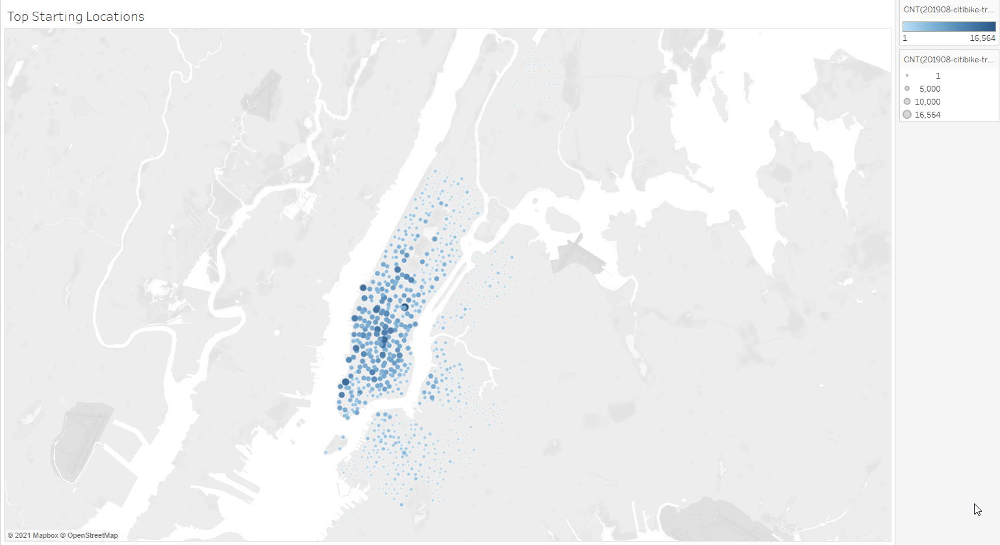
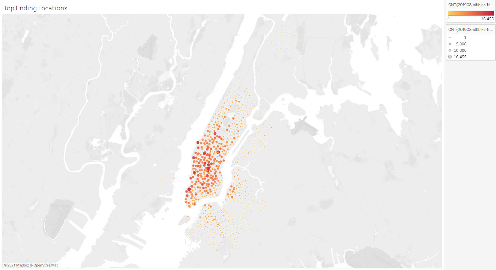
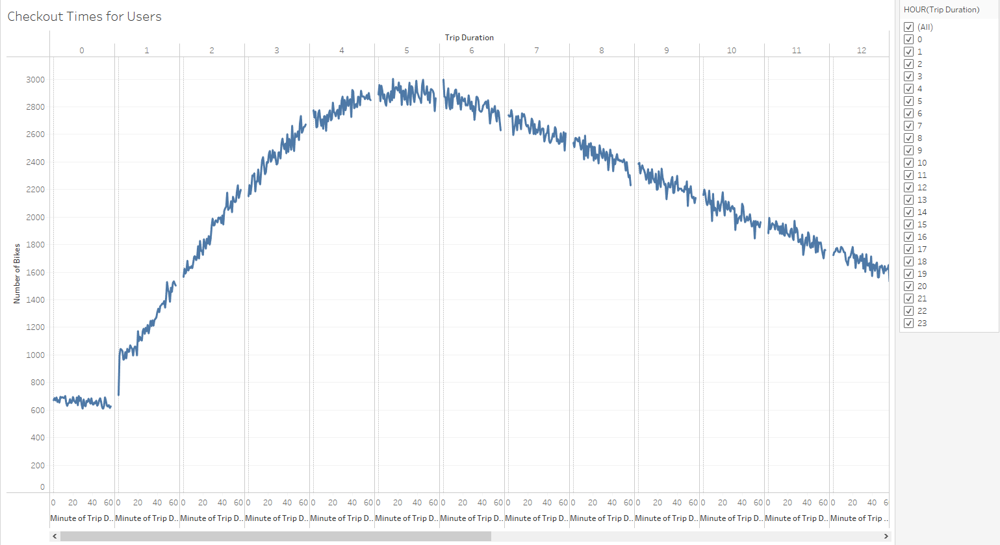
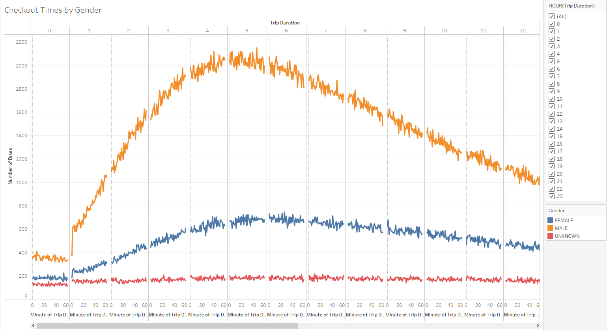
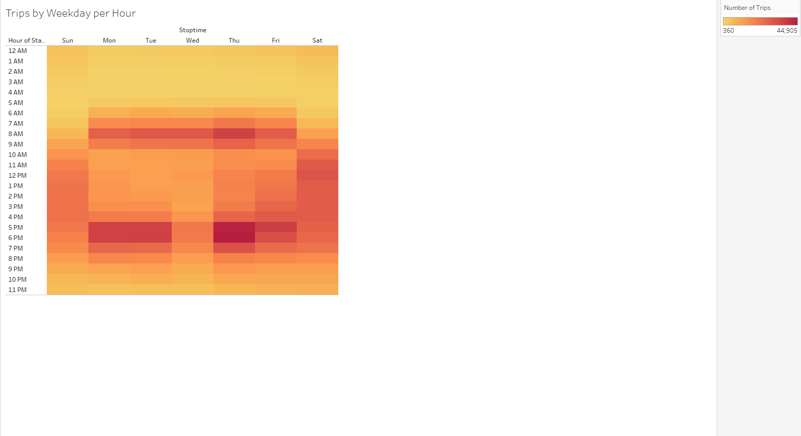
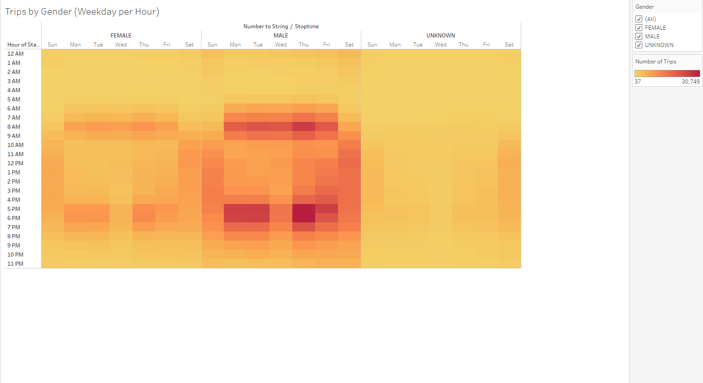
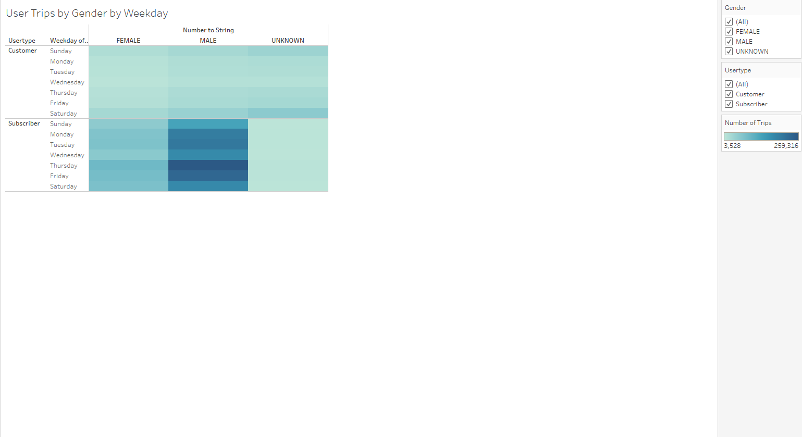

# Bike Sharing (NYC Citi Bike)

## Project Overview
The purpose of this project was to use publicly available New York City Citi Bike data (from August 2019) with Tableau data visualization to explore a potential bike-sharing program in Des Moines, Iowa. 

## Results
[Tableau Analysis](https://public.tableau.com/app/profile/stephen.tan2882/viz/NYCCitiBikeStory_16277767860180/NewYorkCityCitiBikeStory?publish=yes)

Key statistics from the August 2019 Citi Bike data:
- 2.3m+ rides across NYC
- Of all the riders, 65% were male and 25% were female; the gender of the other 10% was unknown
- 81% of those users had a Citi Bike subscription
- The highest density of rides were taken in Manhattan

### Top Starting Locations

 
- Most bikes are checked out around Midtown in Mahattan
- Bikes that are checked out at Brooklyn often do not get checked back in at Brooklyn

### Top Ending Locations
 
 
- Most bikes are also checked in around Midtown in Mahattan
- More bikes are checked in at Manhattan than at Brooklyn

### Checkout Times for Users

 
- 4 to 6 hours is typically how long bikes are checked out for
- 5 hours is the most frequent check-out time
 

### Checkout Times by Gender
<
 
- Males take around 3x more bike rides than females

### Trips by Weekday per Hour

 
- Peak bike usage is generally between 7-9AM and 5-6PM on weekdays
- Wednesday is the least busy bike day
- Saturdays and Sundays have the most bike usage between 9AM and 7PM

### Trips by Gender
<
 
- Males commute by bike more than females do, especially on weekdays

### User Trips by Gender by Weekday

 
- Males have more Citi Bike subscriptions than females, but the same cannot be said for those that do not subscribe

## Summary
Explain. 

Additional analyses such as (1) throughout different times of the year (perhaps one in each season) would show how the seasons and (2) weather affect Citi Bike usage. These analyses would help determine trends amongst customers and subscribers.
